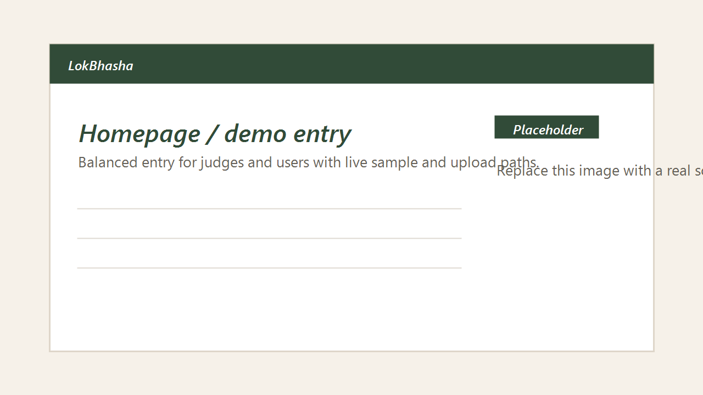
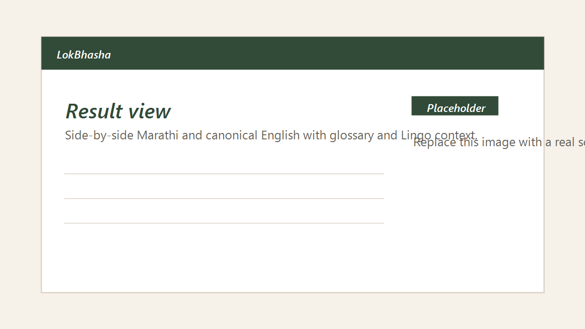

# LokBhasha

> Understand Marathi government documents in clear English, then localize them into other Indian languages with Lingo.dev.

LokBhasha is a document localization workflow built for public-service communication. It takes a Marathi circular or notice, extracts the source text, detects government terminology from a curated glossary, produces canonical English through Lingo.dev, and then localizes that English into user-selected Indian languages.

## Demo

- Live app: [lokbhasha.vercel.app](https://lokbhasha.vercel.app)
- Demo video: [YouTube walkthrough](https://www.youtube.com/watch?v=8Ga9puHhpMc)
- Frontend: Vercel
- Analyze service: Render
- Extraction service: Render
- Localization engine: Lingo.dev

## Why This Matters

Government documents often reach citizens in language that is hard to access quickly, especially when terminology is formal, domain-specific, or inconsistent across departments. LokBhasha is built to preserve official wording where it matters, while still making the document understandable and portable across languages.

It is designed around three ideas:

- glossary-aware handling for government terminology
- canonical English as a stable bridge language
- user-driven follow-up outputs instead of noisy automatic generation

## What LokBhasha Does

| Step | What happens |
| --- | --- |
| 1 | User uploads a PDF or pastes Marathi text |
| 2 | PDFs are extracted through the private OCR backend |
| 3 | SQLite detects glossary matches from a curated 19k government term set |
| 4 | Lingo.dev localizes Marathi into canonical English |
| 5 | User optionally asks for additional Indian-language outputs |
| 6 | The app shows glossary context, Lingo context, and side-by-side results |

## Why Lingo.dev Is Central

LokBhasha is not using a local translation engine.

- Lingo.dev handles Marathi -> English localization
- Lingo.dev handles English -> selected Indian language localization
- Lingo.dev is the authoritative localization layer
- SQLite is used only for local glossary detection and hover-linked terminology UX

This keeps the translation path aligned with the hackathon goal while still giving the app fast document-side term detection.

## Core Product Experience

- Side-by-side original Marathi and canonical English
- Live PDF upload and pasted-text support
- On-demand Indian-language outputs instead of automatic clutter
- On-demand explanation and action extraction
- Glossary-linked highlighting between source and canonical text
- Quality and setup panels that make the Lingo flow visible

## Screens

These screenshot slots are wired and ready. Replace the placeholder files in `assets/1.png` and `assets/2.png` with real product captures when you are ready.

| Live sample flow | Result view |
| --- | --- |
|  |  |

## Architecture

| Layer | Responsibility |
| --- | --- |
| `frontend/` | Next.js UI hosted on Vercel |
| `analyze/` | Public Node service for glossary detection, Lingo calls, and result shaping |
| `backend/` | Private FastAPI service for PDF extraction and OCR |
| `dict/19k.json` | Curated government glossary source |
| `sqlite/glossary.sqlite3` | Runtime glossary artifact for local detection only |

## Glossary Model

LokBhasha uses a government-specific glossary rather than a generic large dictionary.

- active source: `dict/19k.json`
- runtime artifact: `sqlite/glossary.sqlite3`
- current role: Marathi terminology detection only
- translation authority: Lingo.dev

This separation is intentional:

- SQLite finds important terms quickly inside the document
- Lingo.dev performs the actual localization work

## Stack

| Area | Technology |
| --- | --- |
| Frontend | Next.js, React, Tailwind CSS |
| Public API | Node.js, Fastify-style service structure in `analyze/` |
| Extraction | FastAPI, PyMuPDF, Tesseract OCR |
| Terminology detection | SQLite |
| Localization | Lingo.dev |
| Hosting | Vercel + Render |

## Local Setup

### Prerequisites

- Python 3.11 or 3.12
- Node.js 20+
- Tesseract OCR for scanned PDFs

### Install dependencies

```bash
cd backend
python -m venv venv
venv\Scripts\activate
pip install -r requirements.txt
```

```bash
cd analyze
npm ci
```

```bash
cd frontend
npm ci
```

### Environment

Use `.env.example` as the reference.

Main values:

- `NEXT_PUBLIC_API_BASE_URL`
- `LINGODOTDEV_API_KEY`
- `LINGODOTDEV_ENGINE_ID`
- `LINGODOTDEV_TARGET_LOCALES`
- `EXTRACT_BACKEND_URL`
- `GLOSSARY_DB_PATH`
- `GLOSSARY_SOURCE_PATH`

### Rebuild or verify the glossary artifact

```bash
python scripts/build_glossary_sqlite.py --source ./dict/19k.json --output ./sqlite/glossary.sqlite3
```

```bash
cd analyze
npm run verify:glossary
```

## Run Locally

### 1. Start extraction backend

```bash
cd backend
uvicorn main:app --reload --port 5000
```

### 2. Start analyze service

```bash
cd analyze
npm start
```

### 3. Start frontend

```bash
cd frontend
npm run dev
```

Default local flow:

- frontend: `http://localhost:3000`
- analyze service: `http://localhost:5001`
- extraction service: `http://localhost:5000`

## Public Endpoints

### `POST /extract`

PDF extraction only.

```bash
curl -X POST -F "file=@circular.pdf" http://localhost:5000/extract
```

### `POST /analyze`

Accepts a PDF upload or raw Marathi text, detects glossary hits, localizes to canonical English through Lingo.dev, and returns the core result.

### `POST /enrich`

Generates only the optional outputs the user asks for, such as selected target languages or explanation text.

## Deployment

### Frontend

- hosted on Vercel
- browser-only app
- points to the public Render analyze service through `NEXT_PUBLIC_API_BASE_URL`

### Analyze service

- hosted on Render
- public-facing
- reads SQLite glossary artifact
- calls Lingo.dev
- calls the private extraction service for PDFs

### Extraction service

- hosted on Render
- private/internal
- handles PDF parsing and OCR only

## Repository Notes

- `master` is the shipped branch
- feature work is done in isolated git worktrees before PR and merge
- glossary management is currently dashboard/MCP-facing, not exposed as a public in-app editor

## License

Hackathon project repository. Add your final license here if you want the repo to declare one explicitly.
